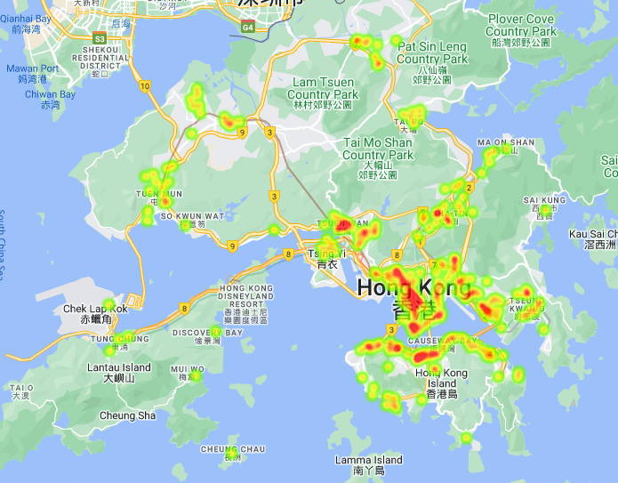
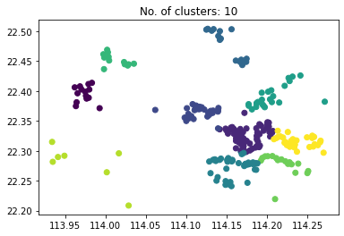
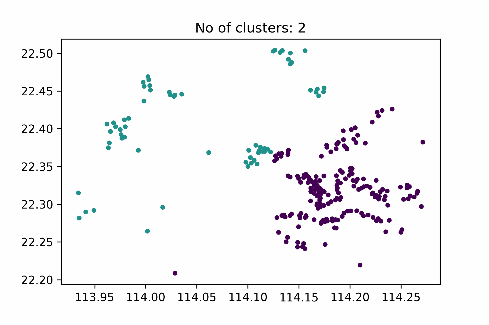
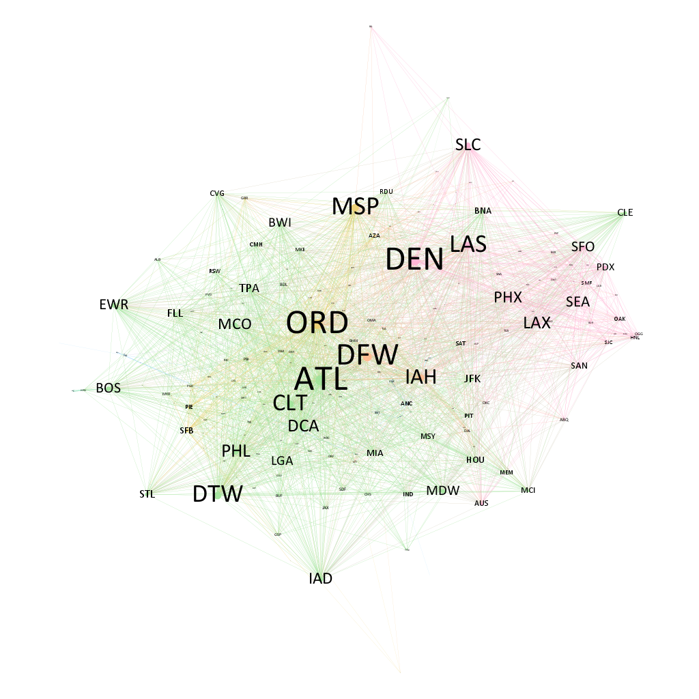
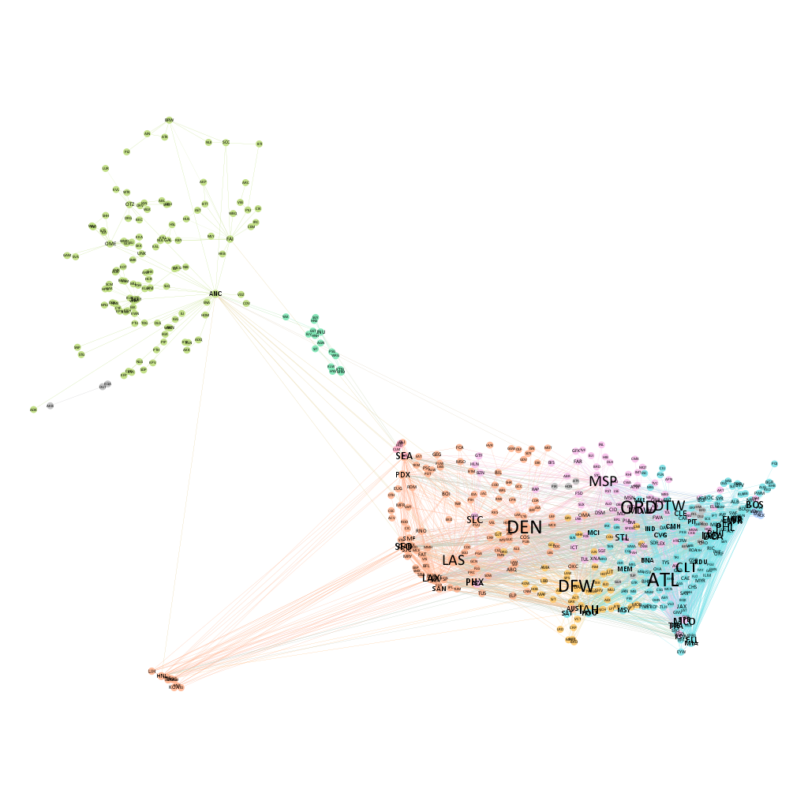
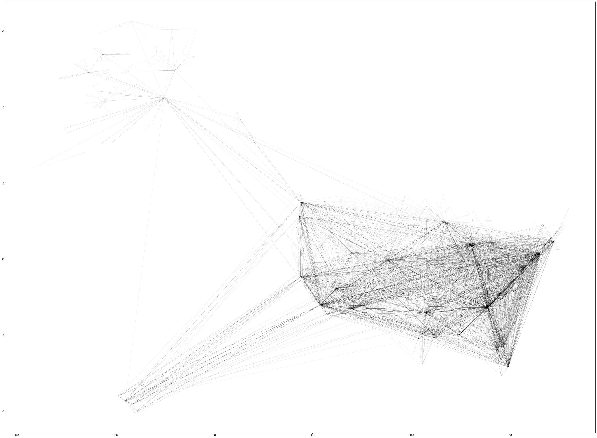

# FINA2390 Financial Programming and Databases  
### HKU, Fall 2022

## Project 2: Data Transformation
Transform a 3000\*1500 data frame to 75000\*40 within 1 minute.  
There are only input and output files. So I need to understand the data structures in both files by myself.  
HKU FINA2390, Nov 2022

Presentation - How to Handle Big Data Science Tasks as a Beginner  
HKU COMP2501, Apr 2023

## Project 3: Visualize the geolocation of 4 fastfood chains
McDonald's, Fairwood, Café de Coral, Starbucks  

1. Convert address to coordinates using `googlemap`.  
2. Plot heatmap using `googlemap`.  

3. Cluster coordinates using `sklearn`.  

4. Animate clusters (GIF) using `matplotlib.animation`.

## Project 4-1: Scrape Tokyo Marathon 2021
Go to record search menu of [Tokyo Marathon 2021](http://www.marathon.tokyo/2021/result/index.php)  
Return a csv file with the following information of all players in the competition:  
a.	Overall Place  
b.	BIB  
c.	Name  
d.	Race Category  
e.	Category Place  
f.	Age  
g.	Age Place  
h.	Sex  
i.	Gender Place  
j.	Nationality  
k.	Nationality Place  
l.	City of Residence  
m.	City Place  
n.	Time(net)  
o.	Time(gross)  
p.	Time lapsed at 5km  
q.	Time lapsed at 10km  
r.	…… (so on and so forth)  
s.	Time lapsed at Finish point  

Input the search criteria (Race Category, Bib, Name, Age Group, Sex, Nationality) and return a csv file with the above information of the players satisfying the search criteria.

## Project 4-2: Scrape Dynamic Search Page: Cathay Pacific

Go to the official website of [Cathay Pacific](https://www.cathaypacific.com/cx/en_HK.html)  
Enter the following search criteria in the code:  
a.	Origin  
b.	Destination  
c.	Trip type  
d.	Cabin class  
e.	Number of adults  
f.	Number of children  
g.	Number of infants  
h.	Departing date  
i.	Returning date  

Note: The website has been updated. However, the method can be migrated to other web search with calendar (hotel, flight etc.).

## Project 5: Gephi Network Visualization
Use Gephi to generate network visualizaion of US airports and flight routes.

